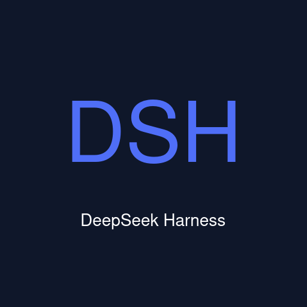

<p align="center">
  
</p>

# DeepSeek Harness Desktop for .NET

<p align="center"><a href="README.md">中文</a> · <strong>English</strong></p>

<p align="center"><strong>A .NET desktop client for DeepSeek Harness — bundled full runtime, download and run.</strong></p>

<p align="center">
  <a href="#features">Features</a> ·
  <a href="#download-and-install">Download</a> ·
  <a href="docs/user-guide.en.md">User Guide</a> ·
  <a href="docs/faq.en.md">FAQ</a> ·
  <a href="#how-it-works">How it works</a> ·
  <a href="#development">Development</a> ·
  <a href="docs/architecture.md">Architecture</a> ·
  <a href="LICENSE">MIT License</a>
</p>

<p align="center">
  <a href="https://github.com/ZK-Andy/dotnet-deepseek-harness-desktop/releases"></a>
  <a href="https://github.com/ZK-Andy/dotnet-deepseek-harness-desktop/releases"></a>
  <a href="https://github.com/ZK-Andy/dotnet-deepseek-harness-desktop"></a>
  <a href="LICENSE"></a>
  <a href="https://github.com/ZK-Andy/dotnet-deepseek-harness-desktop/actions/workflows/ci.yml"></a>
  <a href="https://github.com/ZK-Andy/dotnet-deepseek-harness-desktop/actions/workflows/ci.yml"></a>
  <a href="docs/testing.md"></a>
  <a href="https://github.com/ZK-Andy/dotnet-deepseek-harness-desktop/releases"></a>
  <a href="https://dotnet.microsoft.com/download/dotnet/10.0"></a>
</p>

A **.NET desktop client for [DeepSeek Harness](https://github.com/deepseek-ai/deepseek-harness)** (MIT), built on [Ryn](https://github.com/Yupmoh/Ryn) — a Tauri-for-C# native-webview framework. The shell bundles the complete DeepSeek Harness runtime, so end users need **no separate Node.js or DeepSeek Harness installation** — download and run.

## Features

- ⚡️ **Zero-setup, download and run** — bundles a Node binary + the `@deepseek-ai/dsh` dependency closure (`resources/runtime/`); the shell spawns dsh in the shared data directory `~/.dsh` under a dedicated `desktop` profile. No PATH `dsh`/`node` required (falls back to PATH `dsh` if the bundle is absent). Sessions, credentials and plugins are **one universe with the CLI, TUI and Web**.
- 🔒 **Native, lightweight shell** — C# backend in the OS webview (WebView2 / WKWebView / WebKitGTK), NativeAOT-ready, deny-by-default capability sandbox (`ryn.json`).
- 🔄 **Crash self-heal & session return** — the shell supervises the runtime process: crash → recovery screen (cause / stderr tail + export diagnostics + exit) → auto-restart → same window back to a new URL; **the port stays stable** so the Web UI origin (and page-level session memory) survives — **return to your previous conversation after a crash or restart**.
- ⬆️ **Self-update** — background check at launch plus a manual check under Settings → Desktop Settings; one-click install & restart when a new version is found (`SHA256`-verified packages; `macOS` guides manual update). See [Auto-Update](#auto-update) below.
- 🧩 **Plugin market bundled + version-aware upgrades** — `dsh-market` ships with the package (`dshmarket.tgz`), quietly installed to the dedicated desktop profile (`~/.dsh/profiles/desktop`) on first launch; it auto-restarts to appear. Bundled plugins upgrade by version awareness — when the bundled copy is newer they upgrade automatically and never downgrade. `1200+` plugins are searchable and one-click installable.
- 🖥️ **System tray** — closing the window minimizes to the tray by default (switchable in Settings), with a tray menu for show main window / check for updates / quit; quitting runs an orderly shutdown so the runtime child process is reaped cleanly.
- 🚀 **Single-instance activation** — clicking the launcher/icon again while the app is running raises the existing main window instead of spawning a duplicate instance.
- 🔁 **Launch at login** — one-click toggle in Settings (XDG autostart on Linux / registry Run on Windows / LaunchAgents on macOS).
- 🖼️ **Native icons / Wayland-ready** — icons ship into `hicolor`; `ryn.json:identifier` and `StartupWMClass` are both `io.github.ZK-Andy.dotnet-deepseek-harness-desktop`, so the taskbar associates correctly.

## Download and install

Download the package for your platform from [Releases](https://github.com/ZK-Andy/dotnet-deepseek-harness-desktop/releases) (with `SHA256SUMS`):

| Platform | Arch | Formats |
|---|---|---|
| `Linux` | `x64` / `arm64` | `deb` (`…_linux-amd64.deb` / `…_linux-arm64.deb`) / `rpm` (`…_linux-x86_64.rpm` / `…_linux-aarch64.rpm`) |
| `macOS` | `arm64` / `x64` | `dmg` |
| `Windows` | `x64` | `exe` installer (`…-setup.exe`) |

> **Preview notice**: this project is in an early preview stage and may ship **breaking changes** (data directory layout, configuration format, bundled component versions). **Cross-version data compatibility is not guaranteed**; back up important sessions and configuration before upgrading.
>
> **Unsigned note**: this is an **open-source project and we do not do paid signing**, so releases are **unsigned**. On macOS, if Gatekeeper shows "unidentified developer", right-click → Open, or System Settings → Privacy & Security → Open Anyway. On Windows, if SmartScreen shows "unknown publisher", choose More info → Run anyway. For dev/internal use, `SELF_SIGN=1` signs locally to clear warnings; see [docs/development.md](docs/development.md).
>
> **Test status**: `Linux` is verified by `CI`; `macOS x64` / `Windows` real-machine targeted testing **awaits community support** (no local Intel-mac / Windows hardware here).

## Auto-Update

- New versions are checked once in the background at launch (no polling, no interruptions); you can also check manually under **Settings → Desktop Settings**.
- When a new version is found, a download button appears at the bottom of the sidebar — click it to download, verify and **install & restart in one click** (one system authorization prompt on `Linux`).
- Packages are strictly verified against `SHA256SUMS` before installation; a failed check refuses to install.
- `macOS` does not support silent in-app updates yet — you will be guided to download the `dmg` manually.

## How it works

```text
┌──────────────────────────────────────────────────────┐
│ Ryn shell (C#, OS webview)                           │
│   spawn dsh → parse dsh web: URL → load the Web UI    │
│   crash supervision → stable-port restart → back      │
└─────────────────────────┬────────────────────────────┘
                          │ spawn + shared ~/.dsh · desktop profile
┌─────────────────────────▼────────────────────────────┐
│ Bundled runtime resources/runtime/                    │
│   Node binary + @deepseek-ai/dsh closure + dshmarket  │
│   dsh web (localhost)                                │
└──────────────────────────────────────────────────────┘
```

(Full architecture: [docs/architecture.md](docs/architecture.md).)

## Development

```sh
# prerequisites: .NET 10 SDK; on Linux: WebKitGTK
# optional: bundle the runtime from a local dsh install
scripts/bundle-runtime.sh

# run — uses PATH dsh by default; use the bundled runtime with:
# DSH_DESKTOP_RUNTIME_DIR=$PWD/resources/runtime
dotnet run --project src/DeepSeek.Harness.Desktop

# tests (322/322)
dotnet test dotnet-deepseek-harness-desktop.slnx

# webview devtools (default off)
DSH_DEVTOOLS=1 dotnet run --project src/DeepSeek.Harness.Desktop
```

> The runtime needs a reachable DeepSeek provider credential (e.g. `DEEPSEEK_API_KEY`) to serve the Web UI.

## Layout

```
├── src/DeepSeek.Harness.Desktop/   # Ryn shell: Program + Services/ (runtime supervision, self-update, system tray, single-instance activation, diagnostics)
├── tests/DeepSeek.Harness.Desktop.Tests/  # xunit 322/322
├── resources/runtime/              # bundled Node + dsh closure + dshmarket.tgz (generated, gitignored)
├── scripts/                        # gates + bundle-runtime-ci.sh + package-linux.sh + release-notes.sh
└── docs/architecture.md、testing.md、development.md
```

## License & acknowledgements

- This project: MIT.
- [deepseek-harness](https://github.com/deepseek-ai/deepseek-harness) (MIT) — the runtime this shell hosts.
- [Ryn](https://github.com/Yupmoh/Ryn) (MIT) — the desktop-shell framework.
- Packaging approach references [pilot-harness](https://github.com/op7418/pilot-harness).
