# Architecture

> 现状。`Ryn` 壳 + 回环代理源承载全局 dsh Web UI（ADR `implemented/architecture/2026-09-27-loopback-forward-proxy`）+ Core/Infrastructure/壳三层与端口适配 + 崩溃监督 + 首启引导 + 随包 companion 装配。

## 概览

> 交互版架构图用浏览器本地打开 [architecture.html](architecture.html)（深/浅色主题、平移/缩放、搜索、关系追踪、导出 PNG/SVG）。静态预览：
>
> 
>
> 图源规约见 [architecture.diagram.json](architecture.diagram.json)（archify `architecture` 类型，`--quality showcase` 校验后 `deliver` 生成 HTML 与缩略图 SVG；改图只改 JSON 并重新生成，不手改产物）。

* 壳只管生命周期、窗口、恢复；`dsh` 的插件树即应用运行时。
* **共享 home**：默认上游规范 `~/.dsh`（优先级 `DSH_DESKTOP_DSH_HOME` > 生态 `DSH_HOME` > `~/.dsh`），home 层数据与 CLI/TUI/Web 互通；桌面插件装配走专属 `profiles/dotnet-desktop`（ADR `2026-09-09-desktop-profile-rename`）。
* **可观测性**：壳侧诊断经 `HostLog` 双写 stdout 与 `<home>/logs/host.log`（超限滚动）；`RunMarker` 判定非受控退出；`desktop.diagnostics.export` 导出白名单诊断 zip（ADR `2026-08-24-shell-observability-diagnostics`）。
* **托盘与 hide-to-tray**（ADR `2026-08-24-shell-tray-hide-to-tray`）：`Ryn.Plugins.Tray` + companion 事件中继；关窗默认隐藏，`CloseGate` 唯一放行通道。

## 分层与组合根

* 三工程：`Core`（纯逻辑，零外层引用）/ `Infrastructure`（Ryn、dsh 进程、文件/网络、更新适配器）/ 壳工程（Presentation + 组合根）。
* **组合根只装配**（ADR `2026-09-28-compose-root-form-separation`；规范见 [architecture-standards.md](architecture-standards.md) R1，语义闸 `verify-compose-root.py`）：`Program.cs` 薄壳 + `DesktopBootstrap.cs` 只保留容器之前的启动头部（WebKit 沙箱降级 / 运行时与 dev 解析 / 单实例仲裁 / 回环代理启动）+ 唯一 dot 分部 `DesktopBootstrap.App.cs` 按域 `AddXxx()` 注册。启动编排搬出根成显式组装的 `Bootstrap.StartupSequence`（容器只给零件：post-Build 值 + 运行期单例；阶段产出为正式类型：`Preflight`/`UpdateSetup`/`AppSetup` 等）。
* **端口在 Core，实现在 Infrastructure**：`IRuntimeHost`（监督，ADR `2026-09-28-runtime-supervisor-core-port`）、`IReleaseFeed`/`IPackageDownloader`/`IPackageInstaller`/`IUpdateEnvironment`（自更新，ADR `2026-09-28-update-coordinator-core-port`）、`IFirstBootBootstrap` 等；`Core.RuntimeSupervisor`/`Core.Update.UpdateCoordinator` 构造注入消费，起步用例 `Core.Bootstrap.RuntimeStarter` 同例（端口 + 委托注入）。跨界 ID 强类型，IPC 帧经源生成上下文（`AppJsonContext`/`UpdateJsonContext`）。

## 启动模型：回环代理源

* **窗口 URL 恒为回环代理源**（ADR `loopback-forward-proxy`）：`DshLoopbackProxy`（`TcpListener` 纯 loopback）在 `BuildApp` 前启动，逐请求向 dsh authority 转发；绑定失败 loud 后降级 wwwroot。**代理端口跨冷启动记忆**（`.dsh-shell-port`，ADR `2026-09-30-shell-proxy-port-persistence`）：有记忆试绑、被占 loud 降级 OS 分配并重记——页面 origin（= 代理 origin）稳定，dsh Web 端「当前会话」localStorage 才能跨重启命中恢复。**启动链零 host 导航**——dsh 未就绪时代理本地端点出 holder 页（自 `fetch` 就绪后自 `reload`），绕开 saucer `set_url` 同步原生挂家族；`/__shell_ready` 长轮询铸币门、`/__shell_guide/*` 磁盘指南页。
* **铸币与转发**：`DshShellForward.MintAsync` 用 token 铸 cookie（`redirect: manual`）；代理贴壳 cookie 转发、`Set-Cookie` 永不回页面、SSE 流式直通、POST content 头保真；WS 升级走裸 TCP 隧道 + 头手术（`Host`/`Origin`/`Referer` 同源 dsh authority，页源三值零透传，ADR `2026-09-27-upgrade-tunnel-host-authority`）。日志只记状态码/头名/字节数，token/cookie 值不落盘。
* **落定与裁决**：`SettleWebSessionAsync` 探针采 `location.origin` + 可见文本，`Core.WebAuthRecovery.ClassifyDetail` 三态裁决（`PageVerdict`：healthy/auth/unknown）；holder 标记排除、探针有限重试（`RuntimeTimeouts.AuthProbeAttempts`）。三处宿主导航点（收养恢复/健康 reload/鉴权重载）以 `Task.Run` 隔离同步原生 `set_url`（ADR `2026-09-26-page-verdict-gate`，吸收合并三篇）。

## 运行时来源（系统全局 node + 全局 dsh）

* **运行时 = 全机唯一一份全局 dsh**（用户 PATH，`@deepseek-ai/dsh@next`；ADR `2026-08-31-simple-shell-single-global-dsh`）：安装器不携带运行时闭包，dsh 版本只读探测走 PATH（`RuntimeVersionGate.ProbeAsync`）。
* PATH 上无全局 dsh 时进入**首启引导**（`RuntimeBootstrap`，spawn dsh 前完成）：确保系统全局 node（复用 PATH 上用户 node/npm；无则下载官方 node 装到系统全局前缀，写系统位需 sudo 时提示手动命令）→ `npm install -g @deepseek-ai/dsh@next` → 验证 `dsh --version`。进度页可见、失败可重试（`desktop.bootstrap.retry`）；引导落定前监督器与插件安装均被门控。

## 监督、单实例与退出

* `Core.RuntimeSupervisor` 经 `IRuntimeHost` 端口监督子进程：退出 → 恢复页 → `RestartAsync` → 同端口导航（重启复用记忆端口保 `origin`）。
* 端口漂移判据（`Core.RuntimeLineage`，ADR `2026-09-12-runtime-handoff-adoption`）：新生续任者收养、更早血统残留收割重试、非我方血统回退 OS 分配并告警（建窗后换端口会使「页面→壳」命令通道失效，见 ADR `2026-09-12-port-drift-ipc-origin-mismatch`）。
* `LauncherActivation` UDS 单实例仲裁（Windows 不启用）；托盘「退出」走有序编排：取消监督 → 整树回收 → marker Release → 关窗 → 8s 看门狗。

## 插件装配（spawn dsh 前就位）

* 随包 `dsh-desktop-companion`（internal）spawn 前静默自愈：`EnsureBundledPluginsBeforeSpawnAsync` 按 `Core/Plugins/BundledPluginCatalog` 清单未装即装（安装器资源 tgz）、已装则版本感知升级；dshmarket（preset）经引导页「插件准备」步确认/跳过（`desktop.preinstall.choose`，5 分钟无决策默认跳过）。
* 启动前 `DesktopProfileBootstrap.ReconcileProfile` 移除不可解析 bundle 引用；`EnsureWorkspaceAllowBuilds` 放行 `allowBuilds` 6 项。
* **CLI shim**：`CliShimRegistrar.TryRegister` 只注册内容恒定的 `pnpm` shim（Windows `%LOCALAPPDATA%\deepseek-harness\bin` + HKCU Path；Unix `~/.local/bin` + rc 幂等块），优先转发用户自装 pnpm，best-effort 不阻启动。

## 外部链接接管

* 宿主侧 `RynNavigationCallbacks` 在导航边界统一裁决：用户发起的站外 http(s) 拦截开系统浏览器，覆盖 `window.location`/`window.open()`/`<form>` 等一切路径；`ExternalLinkCommandRouter` 收 `app.openExternal` 复核后经 `SystemBrowser`（Linux 承载在独立 transient scope）打开；打开失败经事件推给 companion 渲染 toast。

## 自更新

* `Core.Update.UpdateCoordinator` 四端口（feed/下载器/安装器/环境）+ `UpdateStateMachine`（`idle→checking→downloading→ready→installing` + up-to-date/error）；启动对账后自动检查一次，并发互斥。
* Feed 走 `releases.atom` + 资产页抓取（绕 api 限流）；下载 `.part` 原子改名 + SHA256SUMS 强校验（缺校验文件或非 2xx fail loud 拒装）；安装：Linux pkexec 脚本、Windows Inno 静默重装、macOS v1 报错引导手动。
* UI 经伴生插件 `sidebar.footer.action`（仅 ready 渲染下载钮）与「桌面设置」页推送；参数在 `appsettings.json` `Update` 节，当前版本 = csproj `<Version>`（CI `-p:Version` 覆盖，判据唯一实现 `scripts/package-version.sh`）。**dev 运行不装载自更新栈**（`DSH_DESKTOP_UPDATE_FORCE=1` 显式开启除外）。

## 打包

* 安装器只带壳（publish 全量）+ 安装器自带 companion tgz（`build-companion-tgz.sh` 现打现校验）；`package-linux.sh`（deb/rpm，`Depends: libwebkitgtk-6.0-4, libadwaita-1-0`）、`package-macos.sh`（dmg）、`package-windows.sh`（Inno 唯一链，`packaging/windows/installer.iss.in`）。默认不签名，`SELF_SIGN=1` 转 `dev-sign.sh`（仅内部验证）。
* `verify-package-layout.sh --platform <…>` 断言内容布局；CI 三平台出包与发布走 `package.yml`/`release.yml`（tag 聚合三平台产物创建单个 Release）。流水线形态见 [testing.md](testing.md)。

## 配置与扩展

* `appsettings.json`：`DevTools:false`（`DSH_DEVTOOLS=1` 开启）；`Update` 节。`ryn.json`：`identifier` 与 `StartupWMClass` 同值 `io.github.ZK-Andy.dotnet-deepseek-harness-desktop`。
* dev 隔离（`DSH_DESKTOP_DEV=1` / `DSH_DESKTOP_RUNTIME_DIR`：ApplicationId 加 `.dev` 后缀、DSH_HOME 自动指向 `<仓库>/.cache/dev-home`、显式指回真实 home 时随包插件安装跳过）由 `Infrastructure/LaunchOptions.Resolve` 单点解析——运行步骤见 [development.md](development.md)。
